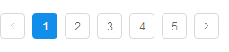
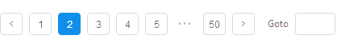

## 分页 Pagination ##

!!! wrap

::: left

当数据量过多时，使用分页分解数据,每次只加载一个页面。

:::

::: right

:::

!!!

!!! wrap

::: left

### 设计方法 ###

• 当加载/渲染所有数据将花费很多时间时。 
• 可切换页码浏览数据。

:::

::: right

:::

!!!

!!! wrap

::: left

### 基础分页 ###

在空间有限或页数较少（建议10页以内）时，可使用基础分页的展现形式。

1.鼠标点击左右按钮可以实现页面跳转，点击“向左”按钮时，往前翻页，点击“向右”按钮时，往后翻页。 
2.可以直接点击任意页数，实现页面跳转。 
3.当前被选中的页面按钮保持高亮，区别于其他未被选中的按钮。 

:::

::: right

:::

!!!

!!! wrap

::: left

### 长分页 ###

在页面空间足够的情况下，展示具体的页数按钮，上下翻页按钮，直接到达首尾页的按钮。

1.鼠标点击左右按钮可以实现页面跳转，点击“上一页”按钮时，往前翻页，点击“下一页”按钮时，往后翻页。 
2.可以直接点击任意页数，实现页面跳转。 
3.鼠标点击“首页”时，直接跳转到首页，鼠标点击“尾页”时，直接跳转到尾页。 
4.当前被选中的页面按钮保持高亮，区别于其他未被选中的按钮。 
5.当前页为第一页时，“首页”按钮和“上一页”按钮不可点。 

:::

::: right

:::

!!!

!!! wrap

::: left

### 跳转分页 ###

钮当页数较多（建议超过10页）时，可以使用跳转分页的展现形式。

1.鼠标点击“向左”按钮时，往前翻页，点击“向右”按钮时，往后翻页。 
2.鼠标点击“最左”按钮时，页面跳转到第一页，鼠标点击“最右”按钮时，页面跳转到最后一页。 
3.在输入框中输入页数，可直接跳转到相应页。 
4.输入框中的页数代表就是当前所在页，随着鼠标操作而改变。 
5.当前页为第一页时，“最左”按钮为不可点状态，当前页为最后一页时，“最右”按钮为不可点状态。 

:::

::: right

:::

!!!

!!! wrap

::: left

### 短分页 ###

在页面空间有限、且页数较多的情况下，可以使用短分页的展现形式。

1.鼠标点击“向左”按钮时，往前翻页，点击“向右”按钮时，往后翻页。 
2.鼠标点击“首页”按钮时，页面跳转到第一页，鼠标点击“尾页”按钮时，页面跳转到最后一页。 
3.显示当前页数和总页数，当前页数随鼠标操作而改变。 
4.当前页为第一页时，“首页”按钮为不可点状态，当前页为最后一页时，“尾页”按钮为不可点状态。 

:::

::: right

:::

!!!

!!! wrap

::: left

### 快速跳转到某一页 ###

查看前面几页的操作频繁，而直接前往中间或靠后的页面，操作相对不频繁时，可使用这种分页的表现形式。

1.鼠标点击左右按钮可以实现页面跳转，点击“向左”按钮时，往前翻页，点击“向右”按钮时，往后翻页。 
2.可以直接点击任意页数，实现页面跳转。 
3.当前被选中的页面按钮保持高亮，区别于其他未被选中的按钮。 
4.在输入框中输入页数，可直接跳转到相应页。 

:::

::: right

:::

!!!

!!! wrap

::: left

### 完整功能 ###

该显示方式几乎囊括了所有翻页的功能表现形式，显示页数、调整每页显示条数、基础的翻页、快速跳转到某一页，这种形式可以同时满足多种场景的使用。

1.显示了所有数据的总量。 
2.鼠标点击显示条数下拉框，可以选择在当前页显示多少条内容，该功能多应用于表格的翻页控件中。 
3.其他使用操作说明同上。 

:::

::: right

:::

!!!

