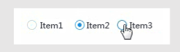
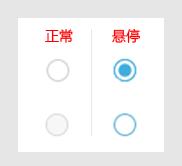
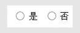
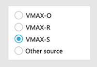

##  单选框 Radio ##

!!! wrap

::: left

单选框可以让用户在两个或多个互斥的状态、动作或值之间进行选择，且用户只能选择其中一个选框。

:::

::: right

:::

!!!

!!! wrap

::: left

### 设计方法 ###

-  能使用单选框时，尽量不使用下拉菜单，在所有选项都被清晰地列举出时，用户更容易进行比较，做出正确的选择。

- 使用单选框时，一般要提供一个已经选中的默认选项。选中其他选项时，自动取消

- 单选框不用于触发任何动作。

- 选项句式不宜过长、易于理解和区分，用户能够在短时间内抓住关键信息。选项的排列按照一定的逻辑顺序，方便用户快速做出选择。

- 如果用户并不想做出明确选择，应为此提供选项，比如“不知道”。为用户预先选定一个清楚中立的选项好过让他们从列表中寻找含义不明的选项做出选择。

- 单选框所占空间很小，不易被点击。为了扩大点击区域，应设置热区使得单选框及选项都能被选中。

- 使用单选框时应尽量避免与其他单选框或复选框嵌套。应使所有选项保持平级以避免用户混淆。

:::

::: right

:::

!!!

!!! wrap

::: left

### 水平排列单选框 ###

1.当选项较少时，一般使用水平排列单选框，如互斥的两项选择。 

2.应使用一致的间隔。测量所需的空间，以适应最长的按钮标题，并一致地使用该度量。 

3.单选框间的间隔要有一定的距离，方便明了按钮所对应的标签来进行选择。

:::

::: right

:::

!!!

!!! wrap

::: left

### 垂直排列单选框 ###

1.选项较多时，一般使用垂直排列单选框，建议每行只有一个选项，易于用户快速浏览定位。 
2.单选按钮组每组拉开一定的距离，使选项对应标题。

:::

::: right

:::

!!!

