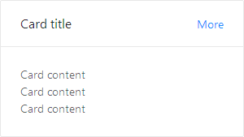

## 卡片 Card ##

!!! wrap

::: left

通用卡片容器。

:::

::: right

:::

!!!

!!! wrap

::: left

### 设计方法 ###

最基础的卡片容器，可承载文字、列表、图片、段落，常用于后台概览页面。

:::

::: right

:::

!!!

!!! wrap

::: left

### 基础用法 ###
 
包含标题、内容、操作区域。

:::

::: right

:::

!!!

!!! wrap

::: left

### 可交互卡片 ###
 
1、每个卡片容器上显示代表该模块内容的关键信息。 
2、关键信息可以是文字或数字、图标。 
3、通常为多个同时使用，并列展示。 

:::

::: right

:::

!!!

!!! wrap

::: left

### 可下拉卡片 ###
 
1、每个卡片容器上显示代表该模块内容的关键信息。 
2、关键信息可以是文字或数字、图标。 
3、通常为多个同时使用，并列展示。 
4、常见于树形导航中。 
5、带下拉功能，下拉菜单中包含对该卡片的多种操作。

:::

::: right

:::

!!!
 
