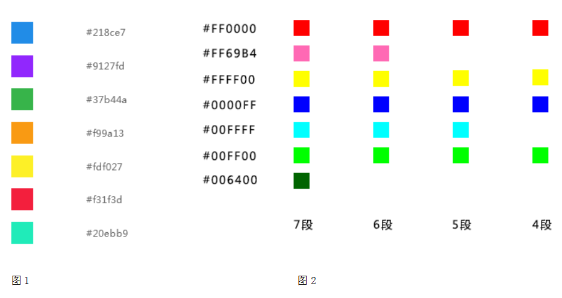
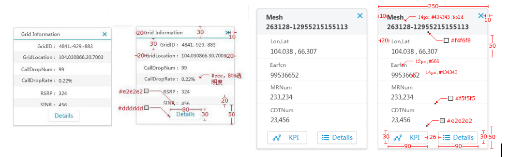
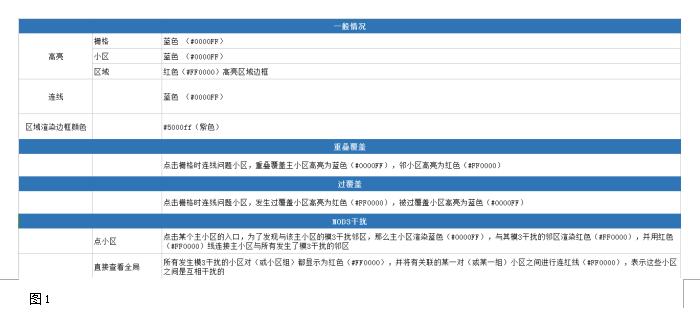
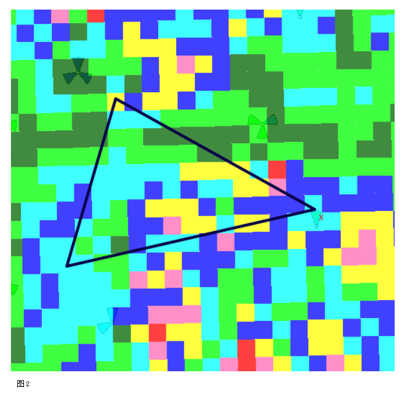

## 地图 GIS ##

!!! wrap

::: left

显示查询和分析当前位置的信息状态，提供信息支持与服务。

:::

!!!

!!! wrap

::: left

### 设计方法 ###

GIS内存在三个基本可互动元素： 

• 1. 栅格 / Mesh，栅格为地图拆解的最小单元，一个栅格通常代表一片地理位置，通常表示问题发生的对应点，也是问题的起点之一。 
• 2. 小区 / Cell，指基站使用不同的电磁波覆盖不同的区域所分为的不同的小区，通常一个基站分为三个小区。 • 3. 区域 / Area，区域是一片栅格的集合，通常我们会针对一定范围内的低质量栅格进行统计，再将其划分为特定区域，便于从区域快速定位问题。

:::

::: right

:::

!!!

!!! wrap

::: left

### GIS配色-图例渲染配色 ###

图例是集中于地图一角或一侧的地图上各种符号和颜色所代表内容与指标的说明，有助于更好的认识地图。它具有双重任务，在编图时作为图解表示地图内容的准绳，用图时作为必不可少的阅读指南。图例应符合完备性和一致性的原则。

1.图例应符合完备性和一致性的原则。 
2.MIMO Rank等指标按类型进行渲染时，无好坏之分的配色方案，色值及顺序： #218ce7 #9127fd #37b44a #f99a13 #fdf027 #f31f3d #20ebb9，如图1。 
3.掉话等指标按次数等进行渲染，指标区域有好坏之分，如图2。 

:::

::: right

:::

!!!

!!! wrap

::: left

### GIS图例加载异常 ###

当地图加载异常时显示异常图标。

加载异常：字体与图例面板居中，字号14加粗,色值：#cdcdcd。

:::

::: right

:::

!!!

!!! wrap

::: left

### GIS提示 ###

GIS提示框用于呈现用户正在交互的栅格、小区、区域的地理位置以及相应的业务承载信息。

1.提示框应与背景在颜色、空间等上拉开距离，让用户易于识别。 
2.应能迅速找到关闭提示框的按钮。 

:::

::: right

:::

!!!

!!! wrap

::: left

### 命名规则 ###

包括小区、栅格、区域的命名规则。

1.栅格命名规则：实际示例：5041_-5489_1510 字段显示：国际-MeshID / 国内-栅格编号 命名规则：[RegionID]_[XOffset]_[YOffSet]。  
2.小区命名规则：实际示例：64651_0 字段显示：国际-CellKey / 国内-小区编号 命名规则：国际-[CellName] / 国内-[EnodeB ID]_[CellID]。 
3.区域命名规则：实际示例：信阳市区_20170420_250 字段显示：国际-AreaName / 国内-区域编号 命名规则：[行政区/县（系统部署区域的最小行政区划单位)]_[YYYYMMDD]_[ID] YYYYMMDD， 为年年月月日日 ZZ 为当前的周数，需要两位 01,02...,53 QQ 为当前的月数，需要为两位 01,02，..,12 ID ，当前区域，当前日期，当前功能按排序规则排列出来的序号，序号为顺序累加 从1开始，目前建议最长不超过3位 W/M 当为周粒度集合是，使用W，月粒度使用M。  

:::

!!!

!!! wrap

::: left

### 联动效果 ###

包括GIS外部与GIS内部元素的互动，为用户查找、定位问题奠定了基础。 

1、一般联动规则： 
◌ 用户可从两个位置输入与GIS相关联的操作： 
a. GIS外部的图表元素等 。 
b. GIS内部的GIS元素, 例如可互动的栅格、小区、区域等元素。  
◌ 点击后联动相应的子集元素，触发显示对应内容 GIS元素基本事件 
a.点击GIS元素，高亮、连线对应的GIS元素, 弹出GIS元素对应的悬浮窗。 
b. 点击GIS元素对应悬浮窗的 Detail，页面下钻，刷新图表元素，保留相关联高亮效果以及连线。 
◌ 图表元素基本事件  
a.点击栅格/小区/区域列表表行，触发对应GIS元素基本事件 1 。 
b. 点击栅格/小区/区域列表上的Detail, 触发对应GIS元素基本事件 2。 

 

::: left

2、小区高亮、连线颜色
如图1所示

3、GIS框选绘图 
颜色#070047（深蓝色）。  
效果图如图2所示。  
多边形属性:： sideBySise.layerStyle_ = { strokeColor:"#070047", strokeOpacity:1, strokeWidth:4, pointRadius:6, fillColor:"##070047", fillOpacity: 0 

:::

::: right

:::

!!!

