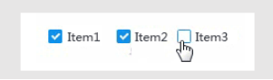
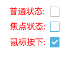
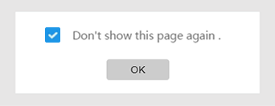
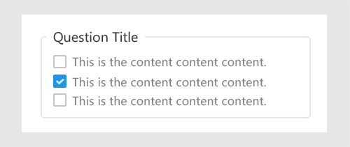

##  复选框 Checkbox ##

!!! wrap

::: left

复选框可以提供用户在一组相互独立的选项中选择零至多个的操作。

:::

::: right

:::

!!!

!!! wrap

::: left

### 设计方法 ###

- 选项句式不宜过长、易于理解和区分，用户能够在短时间内抓住关键信息。选项的排列按照一定的逻辑顺序，方便用户快速做出选择。

- 选项较多且全选或全不选可能性较大时，可以提供一个全选选项。

- 尽量避免在复选框选项中应用否定句式。一旦这样做，用户必须涉猎完所有的选项，才确保自己不想选择的事情不会发生。例外情况：当弹出“不要再提示该信息”时，类似的选项中可以应用否定词。

- 复选框所占空间很小，不易被点击。为了扩大点击区域，应设置热区使得复选框及选项都能被选中。

- 复选框一般不设置默认勾选选项。

 

:::

::: right

:::

!!!

!!! wrap

::: left

### 单独选项 ###

1.单个复选框用来作独立选项的选择动作。应用于“不再显示此项”，“同意使用规则”等场景。 

2.勾选表示肯定，不勾选表示否定，默认状态为不勾选。

:::

::: right

:::

!!!

!!! wrap

::: left

### 多个选项 ###

1.在一组复选框里用户可以选择任意数量的选项。 
2.可以思考需不需要用框来组织复选框组。 
3.按照逻辑来排列组织复选框选项，例如把意义相关的选项放在一起，把常见选项放在前面，接下来放置次常见选项。 
4.建议纵向排列复选框便于阅读。

:::

::: right

:::

!!!

