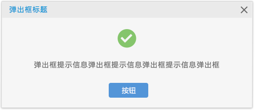
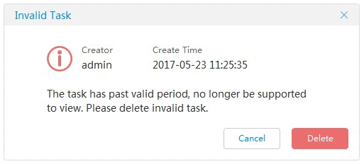

##  对话框 Dialog ##

!!! wrap

::: left

对话框和浮出控件同样是一个瞬态 UI 元素，它在当发生需要通知、批准或处理页面中一些繁复信息的操作时出现。它们通常会请求并询问用户进行某种类型的操作。除非明确取消对话框，否则它会阻止与应用窗口的交互，如果用户需要关心的内容在对话框外，请使用 "消息" 而不是 "对话框" 以避免打断用户操作。

:::

::: right

:::

!!!

!!! wrap

::: left

### 设计方法 ###

- 由于对话框会中断操作，强迫用户去停止他们当下正在进行的任务，并转而专注于对话框中的内容，所以应尽可能地减少对话框的出现频率。需要用户去互动才可继续，或犯一个成本会很高的错误时，使用对话框是合适且合理的。

- 对话框内容必须包含描述性文本，文案应简洁明了。避免使用模凌两可或反问式的语气。在弹出框的第一行文本中清楚地标识问题或用户的目标。

- 在需要引导偏向时，用“你确定···？”，无法揣测用户意图时用“你是否···？”。

- 对话框至少显示一个安全操作按钮，例如“知道了”，“取消”或右上角“×”键。

- 有多个操作按钮时，“执行”操作按钮应显示为最左侧按钮，安全、无破坏性的操作应显示为最右侧的按钮。

- 避免在弹出框内启动新的弹出框。因为此举会加深用户所感知到产品的层级深度，增大了视觉的复杂性。

:::

::: right

::: 

!!!

!!! wrap

::: left

### 模态显示方式 ###

是一种常见的对话框呈现模式。用户可以点击 "x" 或键盘上的 "ESC" 或背景遮罩隐藏对话框。如果该对话框用于承载重要操作，可屏蔽背景遮罩的点击隐藏功能，防止用户误触。

1.带有标题的对话框，标题用于突出对话主旨。 但如果非必须, 请尽量避免频繁使用标题。一段简短的正文能让用户更快地了解所传达的信息。 
2.标题应该具有如下属性：使用清晰明确的疑问句或陈述句表达对话框的主旨，避免使用含糊不清的语句，如 "警告!" 或 "错误!" 等。 
3.与表单共同使用时，若当前页面无法承载更多信息, 或不想在新页面处理事务时, 可以将表单放置于对话框内, 待用户处理完成后再更新原页面信息即可
  

:::

::: right

:::

!!!

!!! wrap

::: left

### 气泡显示方式 ###

是一种相较于模态形式的对话框更为轻量的呈现方式。 

1.如果操作必须需要用户二次确认，且多次以相同模式重复出现，可使用气泡形式承载对话框内容，减少用户操作。如果不需要二次确认, 建议用消息框来承载提示信息, 避免打断用户操作。 
2.关闭气泡对话框时，气泡对话框通常不会在出现时呈现背景遮罩, 但是在其出现时, 点击其他非气泡位置可以快速关闭, 相应的点击操作也会被吸收, 不会传递到其下方的 UI。换言之, 其拥有一个透明色的背景遮罩。 

:::

::: right

:::

!!!

