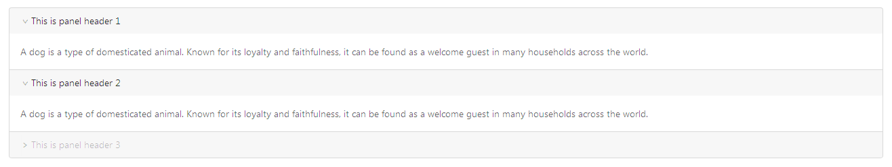
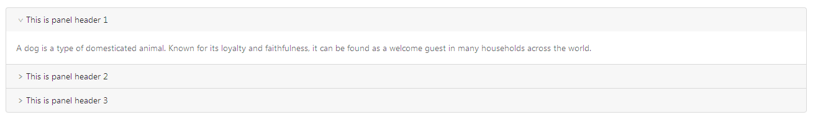
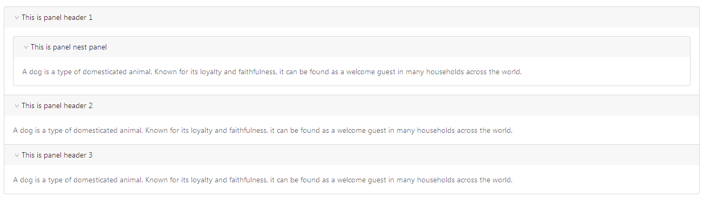
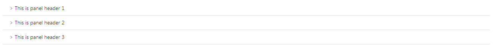
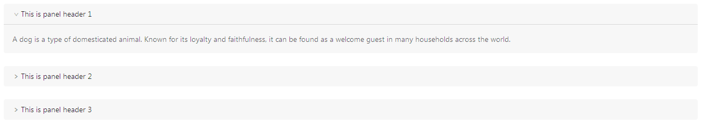

## 折叠 Collapse ##

!!! wrap

::: left

可以折叠/展开的内容区域，多见于下滑菜单和手风琴效果中。

:::

::: right

:::

!!!

 

!!! wrap

::: left

### 设计方法 ###

• 对复杂区域进行分组和隐藏，保持页面整洁。 
• 手风琴是一种特殊的折叠面板，只允许单个内容区域展开。

:::

::: right

:::

!!!

!!! wrap

::: left

### 基础分页 ###

可同时展开多个面板，面板之间不影响。

1.点击下拉图标或者有下拉图标的一整行区域，折叠区域下拉展示出来。 
2.再次点击收起折叠区域。 
3.可以同时展开多个面板，面板之间不影响。 
4.应该设计不可点的状态。 

:::

::: right

:::

!!!

 

!!! wrap

::: left

### 手风琴 ###

每次只打开一个tab，默认打开第一个。

1.点击下拉图标或者有下拉图标的一整行区域，折叠区域下拉展示出来。 
2.再次点击收起折叠区域。 
3.每次只能打开一个tab,不能同时打开多个tab。 

:::

::: right

:::

!!!

 

!!! wrap

::: left

### 面板嵌套 ###

嵌套折叠面板。

1.在一个折叠面板里面嵌套了另一个折叠面板。 
2.可以同时打开多个面板。

:::

::: right

:::

!!!

 

!!! wrap

::: left

### 简洁风格 ###

在页面空间有限、且页数较多的情况下，可以使用短分页的展现形式。

1.点击下拉图标或者有下拉图标的一整行区域，折叠区域下拉展示出来。 
2.再次点击收起折叠区域。 
3.可以同时展开多个面板，面板之间不影响。 
4.面板没有边框。

:::

::: right

:::

!!!

 

!!! wrap

::: left

### 自定义面板 ###

自定义各个面板的背景色、圆角和边距。

1.点击下拉图标或者有下拉图标的一整行区域，折叠区域下拉展示出来。 
2.再次点击收起折叠区域。 
3.可以同时展开多个面板，面板之间不影响。 

:::

::: right

:::

!!!
