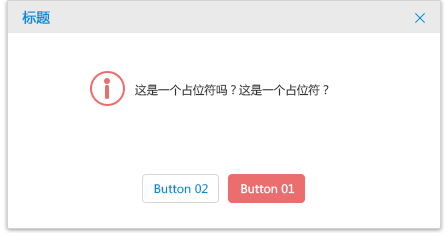
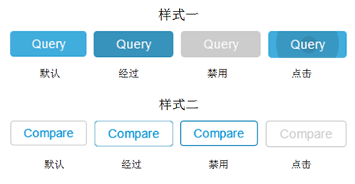
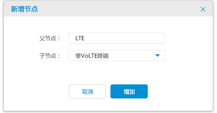

## 按钮 Button ##

!!! wrap

::: left

按钮出现在一般的场景中，用于发起即时的具体操作并获取相应的结果，例如获取数据比对结果。按钮的样式通常在图形上叠加文本（非图标），通过对按钮的操作常常能开启一个独立的窗口、对话框或者弹窗卡片，从而让用户完成某项任务。

:::

::: right

:::

!!!

!!! wrap

::: left

### 设计方法 ###

- 在心理上，用户更倾向于点击默认状态的按钮。在有限的页面空间内，默认状态的按钮通常能有效的吸引到用户的视线。

- 在按钮中使用文本，即使需要增加图标也需要配合文本一起使用。

- 按钮中的英文文本首字母需大写。

- 按钮中的文本需要使用动词。

:::

!!!

!!! wrap

::: left

### 窗口按钮 ###

通常出现在窗口的最下方。用户浏览完该窗口所有内容后发起对窗口按钮的操作指令（需要提供按钮的焦点状态，并可通过Enter键触发）。常用于对执行的某项具体操作的确认。

1.确定用户是否将要对某项具体任务进行操作时可使用（与卡片同时使用）。 
2.文本按钮分为两种样式，每种样式默认必须有四种状态，默认、悬停、点击以及不可用，不同的状态有明显的视觉区分（如图所示）。 
3.在每个对话框中，均有一个默认命令的焦点状态，支持Enter键出发激活；将最安全可靠的命令设置为优先级，作为按钮的默认焦点状态。 
4.对于重要且以安全考虑为优先级的命令可以参考规范中色彩的使用场景进行颜色替换。

:::

::: right

:::

!!!

!!! wrap

::: left

### 表单按钮 ###

在完成表单的编辑信息的操作后，确认该区域的信息内容并发起确认提交的操作。

1.用户确定表单里的内容之后需要执行具体操作时可使用（与表单同时使用）。 
2.在每个对话框中，均有一个默认命令的焦点状态，支持Enter键出发激活。 
3.在执行最终按钮操作前，可以修改表单里的内容。 

:::

::: right

:::

!!!

!!! wrap

::: left

### 图标按钮 ###

由文本、图标和底层图形或者图标加文字构成。图标对文本进行辅助性释义并在底层图形上显示。

1.通常图标按钮的样式分为两类：图标+文本+底色、图标+底色。 
2.在页面中同一行的位置里，空间充足的情况下，按钮数量少于或等于三个建议使用图标文本按钮；按钮超过三个则使用图标按钮建议使用单一的图标按钮。 
3.为了不造成用户理解的偏差，图标和文本的颜色应始终保持一致，并保持适当的间距。 

:::

::: right

:::

!!!

