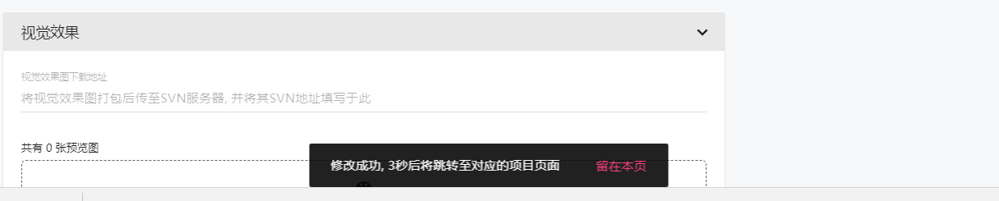

## 提示框 Snackbar ##

!!! wrap

::: left

提示框与消息框比较相似，也是一种轻量级的反馈机制。与消息框一样，通过用户的操作行为触发，并在页面停留几秒后消失。与之不同的是，提示框可以承载稍复杂的内容并附有简易的操作功能。

:::

!!!

!!! wrap

::: left

### 设计方法 ###

- 对于提示框的样式没有特殊的限制。但为了组件统一，建议在同一个产品中，与其他容器状控件样式保持一致。

- 提示框能承载比消息框稍复杂的内容，例如复杂的语句或者更多的语句（不建议放置成段的内容）。

- 提示框上可以放置浮动的的操作按钮，例如“关闭”、“取消”等按钮。

- 提示框会出现在屏幕所有层级的最上层。

- 提示框的不能覆盖页面的重要信息，也不能阻挡操作按钮。

:::

::: right

:::

!!!

!!! wrap

::: left

### 提示框 ###

提示框可以像消息框一样反馈用户的操作行为。在某些场景下带有一定的交互性（出现浮动操作按钮），在出现几秒后消失。通常提示框适合在不遮挡、不影响用户原先操作的情况下弹出。

1.通常提示框用于容纳文本，不建议文本和图标结合使用。 
2.如果场景或页面需要，提示框可以包含有个以下的操作行为，例如“关闭”、“取消”、“撤回”、“再次发送”等此类操作；如果需要包含两个及以上的操作，推荐使用对话框或其他信息容器控件。 
3.使用提示框时，建议让消息框在页面停留3-5秒后自动消失，或者点击页面的其他区域也可让其消失。 
4.在同一页面，提示框只能显示一条，不建议相互堆叠；当用户连续执行了一项以上的操作行为时，待当前提示框消失后，下一提示框才会显示。 

:::

!!!

