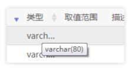
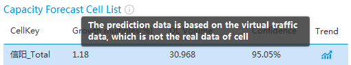

## 文字提示 Tooltip ##

!!! wrap

::: left

文字提示是链接到另一个控件或对象的简短描述，以小弹框的样式呈现。文字提示用直接描述的方式帮助用户了解界面中不熟悉的对象。它们会在用户将焦点移动到控件、或将鼠标指针停在控件上时自动显示。几秒钟后或者当用户移动指针或键盘焦点时，文字提示将消失。

:::

!!!

!!! wrap

::: left

### 设计方法 ###

- 当鼠标或焦点移动到界面中某个对象上并停留时，文字提示会出现。

- 文字提示的功能类似于标签，描述或进一步解释页面中的某个元素解除用户使用的疑惑。

- 文字提示内需要提供描述性的文本内容且必须要十分精确。

- 文字提示的功能是补充鼠标焦点停留的对象的信息，所以文本内容必须与焦点对象有密切关联性。

- 文字提示应该是静止的状态。用户不希望焦点对象的提示信息逐条跳转，或是小范围地运动，建议针对每个对象的文字提示只有一条，并且不增加多余动效。

- 文字提示会出现在屏幕所有层级的最上层。

:::

::: right

:::

!!!

!!! wrap

::: left

### 文字提示 ###

文字提示应该用于对鼠标焦点对象的进一步描述。

1.文字提示通常为文本提示信息，不建议添加图标。通常文字提示分为两类，浏览器自带、自行引入控件。 
2.对于文字提示内文本的描述，分为两类，词组与补充信息提示、语句信息提示。典型的词组与补充信息的组合提示通常针对按钮、工具栏、可点击的对象，或是比较通俗易懂的内容；语句信息提示针对复杂、容易给用户引起歧义或希望引导用户进行准确操作的信息进行补充。 
3.对于文字提示而言，在最恰当的时候自动显示和自动消失是至关重要的。当鼠标移到对象上并保持静止不少于1秒时，文字提示才会弹出；当鼠标焦点移走后，提示自动消失。 
4.文字提示必须靠近鼠标焦点指向的对象，切忌距离相隔太远。 
5.文字提示并非页面中的重要信息，属于辅助信息，因此不建议干扰页面中的其他重要信息，也不能影响用户的操作；但为了其辨识度，建议区别于触发对象所在区域的背景。

:::

::: right

:::

!!!

!!! wrap

:::  right

:::

!!!

