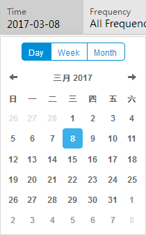
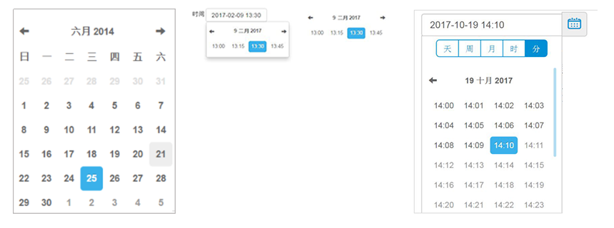

## 时间范围 Range Time ##

!!! wrap

::: left

用于时间和日期的选择，提供单独的日期和时间选择面板，通过时间数据筛选从已有的多元的数据表中得到所需数据。时间控件作为查询的前提条件，一般与查询按钮结合使用。通过时间维度的选择定义查询操作后，点击查询按钮发送操作指令。

:::

!!!

!!! wrap

::: left

### 设计方法 ###

- 时间控件由输入区域和日历面板组成。默认状态常以输入框的形式呈现，有输入框与色块输入区域两种样式。

- 时间控件可让用户选择十年份、年、月、周、日、分这些维度进行条件查询。

- 输入区域的时间不可通过直接手动更改，而需要通过触发日历面板进行选择。

- 与常规日历不同，基于浏览信息的需求增设tab视图，定位在日历的上方。

- 在日历面板中，Tab下方的数值为时间选取器。当日历主面板显示的单位区间为天，时间选取器则以具体年月为单位；点击时间选取器后，日历面板的日期区间会扩大一个层级的范围，即；面板区间显示月，时间选取器的单位显示年；继续点击，以此类推。

:::

!!!

!!! wrap

::: left

### 时间日期选择 ###

点击灰色区域触发日历，在可见的日历中选取一个日期，并能根据Tab进行周和月的选择。

1.通过点击灰色色块的时间显示区域后才能触发日历面板进行时间的选择，不可直接在显示区域进行编辑。 
2.时间控件呈现悬停和点击选中两种状态，悬停状态时，鼠标经过日期时字体会叠加灰色背景；点击选中某个日期之后，该日期叠加蓝色背景，字体        反白。 
3.时间控件的默认日期为当日具体日期，如需要更换时间区间条件，可点击Tab进行切换。 

:::

::: right

:::

!!!

