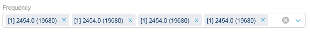
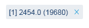
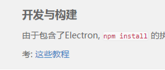
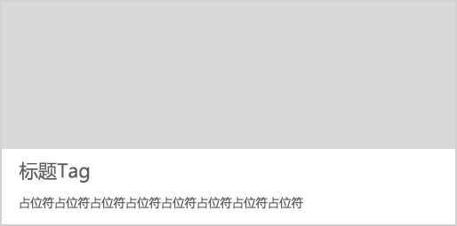
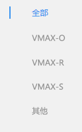
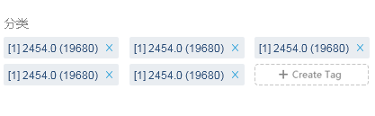

##  标签 Tag ##

!!! wrap

::: left

标签是描述屏幕界面元素或提供短消息的静态文本字段。人们可以对标签进行选择，但不能编辑标签内容，有时可以复制标签内容。

:::

::: right

:::

!!!

!!! wrap

::: left

### 设计方法 ###

- 标签可以包括普通的或样式的文本，可以使用系统提供的标签颜色传达相对的重要性。

- 每一个标签应有足够的代表性，并有所区分。在标签组中，相似性的标签组织在一起，这样用户更加容易识别和辨认。

- 一般地，标签的类型由运营或者业务自己创建，可以自定义每种标签类型。

:::

::: right

:::

!!!

!!! wrap

::: left

### 链接式标签 ###

1.可作为一个单独的词汇可以在不同的词条当中建立链接，这种标签很易于让用户留在网站当中跳转和浏览。 
2.此类标签字体的样式应与正文中的其他字体有所区分，一般采用颜色、背景色、斜体等设置,告知用户可以进行点击。

:::

::: right

:::

!!!

!!! wrap

::: left

### 标题式标签 ###

1.标题作为一个很明显的标签，应准确地代表项目名称、文章内容等。

:::

::: right

:::

!!!

!!! wrap

::: left

### 导航式标签 ###

1.标签系统可以有效的组织网站的信息内容，拥有众多的业务类目时，为了方便浏览就会设计导航标签。 
2.导航标签在选中时应有高亮显示。

:::

::: right

:::

!!!

!!! wrap

::: left

### 分类标签 ###

1.在为控件添加标签时，请将标签写成名词或简洁的名词短语，不要写成一个句子，也不要写成说明文本。避免使用冒号或其他标点符号。 
2.标签的字体，字号，颜色，间距都应该保持一定的规范，需要具有一致性。 
3.分类标签可以支持增、删、查、改功能，不过多数情况下，可以不用做查和改的功能。 
4.当标签中确实有说明文本时，文本字符串长度可以增加，并且可以使用标点符号。 

:::

::: right

:::

!!!

