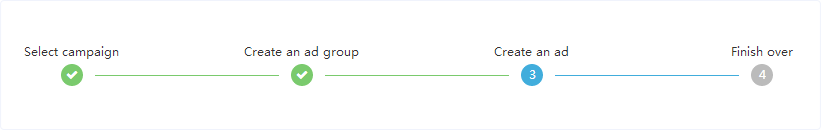
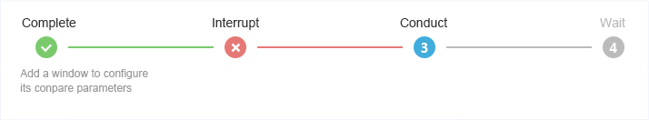
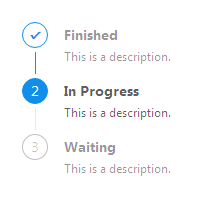

## 步骤条 Steps ##

!!! wrap

::: left

引导用户按照流程完成任务的分步导航条，可根据实际应用场景设定步骤，步骤不得少于2步。

:::

::: right

:::

!!!

!!! wrap

::: left

### 设计方法 ###

• 当任务复杂或者存在先后关系时，将其分解成一系列步骤，从而简化任务。

:::

::: right

:::

!!!

!!! wrap

::: left

### 基础用法 ###

简单的步骤条。
 
1.默认为灰色背景的数字步骤数，正在运行的步骤为蓝色背景的步骤数，该步骤完成后显示为已完成的状态。 
2.步骤图标上面显示更详细的文字步骤描述信息。 
3.运行错误的步骤显示为红色背景、错误表示的图标状态。 

:::

::: right

:::

!!!

!!! wrap

::: left

### 含详细解释信息的步骤条 ###

每个步骤有其对应的步骤状态描述。

1.默认为灰色背景的数字步骤数，正在运行的步骤为蓝色背景的步骤数，该步骤完成后显示为已完成的状态。 
2.步骤图标上面显示更详细的文字步骤描述信息。 
3.运行错误的步骤显示为红色背景、错误表示的图标状态。 

:::

::: right

:::

!!! 

!!! wrap

::: left

### 带图标的步骤条 ###

在相应的步骤，放置可以更加形象直观表示该步骤性质的图标。

图标要能直观形象的表示文字的性质和意义。

:::

::: right

:::

!!!

!!! wrap

::: left

### 竖直方向的步骤条 ###

简单的竖直方向的步骤条。

某些向下展示进度的情况更加直观，除方向外，其他和横向进度条表达一致。

:::

::: right

:::

!!!

