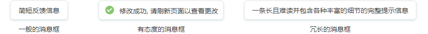

## 消息 Toast ##

!!! wrap

::: left

消息框是一个轻量级的、用于消息提示的弹出窗口。它告知用户完成任务的状态，例如xxx操作成功或失败等。通常情况下由用户执行某些操作后触发，即时反馈上一步操作的相关文本信息，不打断用户原有操作流；同样，用户也不需要对其进行回应，也无法进行操作行为。消息框会在持续数秒后自动消失。

:::

::: right

:::

!!!

!!! wrap

::: left

### 设计方法 ###

- 对于消息框的样式没有特殊的限制。但为了组件统一，建议在同一个产品中，与其他容器状控件样式保持一致。

- 消息框出现的位置与用户的操作最好联系在一起，所以出现在界面中用户最容易关注到的位置是较为合适的。

- 消息框会出现在屏幕所有层级的最上层。

- 消息框的属性简易轻量，通常显示几秒钟后自动消失，因此不建议添加过多的文字信息。

- 消息框中的文本内容建议为词组或简单的陈述句。

:::

!!!

!!! wrap

::: left

### 消息框 ###

通常在用户发起了某个动作并完成了某项操作后，后台系统在页面内会出现简易消息提示框告知用户的操作结果，并在几秒后消失。

1.消息框的样式分为：文本和图标文本组合这两种样式，这两类样式没有明显的使用场景的区分。通常文本消息框用于反馈单一的文本信息，当需要显示“您的信箱已被清空”等这类消息时，推荐使用文本消息框；当需要展示“发送成功”、“刷新失败”等这类对操作结果有明确、强烈定义的消息时，推荐使用图标文本图标，最终还要依据页面场景以及消息内容而定。 
2.一般不太重要的提示消息推荐用消息框，重要的消息推荐用对话框或其他信息容器控件。 
3.使用消息框时，建议让消息框在页面停留3-5秒后消失。 
4.消息框内容显示较少，所以设计PC端的页面时建议消息框在页面内垂直居中对齐。 
5.当用户连续执行了一项以上的操作行为时，消息框可以依次排列叠加显示。建议叠加最多不超过5个。

:::

::: right

:::

!!!

