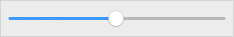
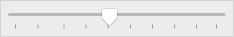
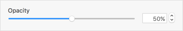
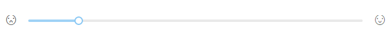
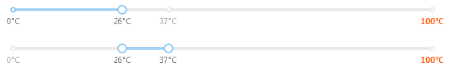
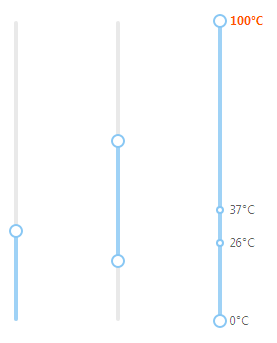

## 滑动条 Slider ##

!!! wrap

::: left

滑动型输入器，展示当前值和可选范围，通过拖动滑块在一个固定区间内进行选择。

:::

::: right

:::

!!!

!!! wrap

::: left

### 设计方法 ###

• 当用户需要在数值区间自定义区间内进行选择时，可为连续或者离散值。

:::

::: right

:::

!!!

!!! wrap

::: left

### 无刻度的直线滑块 ###

按住滑块，可实现滑块的左右移动，并显示当前值。

1.可以任意滑动滑块至任何位置，适合需要精确的自定义位置时的场景。 

:::

::: right

:::

!!!

!!! wrap

::: left

### 分段组件 ###

滑块在各个具有明确间距值的线段区间移动，且只能在这些间距值之间选择。

1.滑块只能一段一段的移动，不能精确到具体的值。 
2.移动操作相对方便简单。

:::

::: right

:::

!!!

!!! wrap

::: left

### 带输入框的滑块 ###

考虑用相应的文本字段和步进器来补充滑块。特别是当一个滑块代表一个广泛的值时，用户可能会欣赏看到精确的滑块值，并具有输入非常特定的值的能力。

1.通过输入框设置精确的位置。  
2.保持和数字输入框组件同步。

:::

::: right

:::

!!!

!!! wrap

::: left

### 范围选择 ###

支持选择某一数值范围。

1.通过移动两个滑块确定范围。 
2.按住其中一个滑块，可左右移动，并显示当前值。

:::

::: right

:::

!!!

!!! wrap

::: left

### 带icon的滑动条 ###

滑块左右可以设置图标来表达业务含义。

1.按住其中一个滑块，可左右移动，并显示当前值。 
2.icon可以用来表达业务含义。

:::

::: right

:::

!!!

!!! wrap

::: left

### 带标签的滑动条 ###

滑块中某些重要位置可以放置一些表示含义的标签。

1.按住其中一个滑块，可左右移动，并显示当前值。 
2.标签可以是数字也可以是文字。

:::

::: right

:::

!!!

!!! wrap

::: left

### 垂直滑动条 ###

垂直方向上的slider。

1.按住其中一个滑块，可左右移动，并显示当前值。 
2.某些用垂直滑块表示更形象的组件，如温度等。

:::

::: right

:::

!!!

