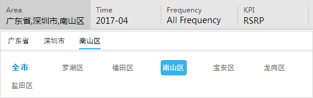
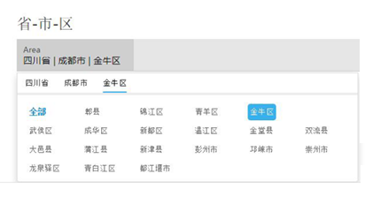
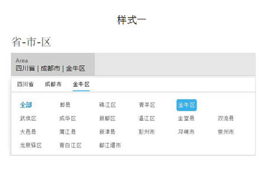
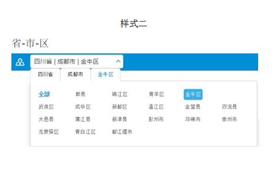

## 级联选择 Cascade ##

!!! wrap

::: left

通过地区的筛选从已有的多元的数据表中得到所需数据。将数据库中不满足筛选条件的数据暂时隐藏，只显示那些符合条件的数据。通常情况下，地区、时间控件一般与查询按钮结合使用。通过地区、时间选择定义查询条件，点击查询按钮发送操作指令。

:::

::: right

:::

!!!

!!! wrap

::: left

### 设计方法 ###

- 地区控件由输入区域和地域显示面板组成。默认状态常与时间和其他的条件一起作为筛选的条件出现，并可通过点击触发地域显示面板。

- 地区控件可让用户选择国家、省份、城市、区这些维度进行条件查询。

- 输入区域的时间不可通过直接手动更改信息，而需要通过点击该区域触发地域显示面板进行选择。

:::

!!!

!!! wrap

::: left

### 地区选择 ###

点击灰色区域触发地域显示面板，在面板中选逐一选择具体的位置，继而配合完成其他选择条件的筛选，发送查询的操作指令。

1.通过点击灰色色块的时间显示区域后才能触发地域显示面板进行时间的选择，不可直接在显示区域进行编辑。 
2.地区控件呈现悬停和点击选中两种状态，悬停状态时，鼠标经过地区时字体会叠加灰色背景；点击选中某个地区之后，该地区叠加蓝色背景，字体反白。 
3.地区控件的默认地区为“北京市”。在触发了地域显示面板后，面板根据由大到小的行政级别依次提供区域选择并在上一次选择后自动跳转到下一级别，直至完成具体区域的选择。 
4.当用户查询的范围不需要精确到“区”时，则可在当前级别页面选择需要的地域后点击面板之外的区域结束选择指令；如想选择上一级别的行政单位，可在当前面板选择“全部”，或者在面板内部的Tab内进行切换修改。
5.地域显示面板内设置有内部Tab，便于用户来回自由地在不同行政级别的区域间切换并进行修改。当在大单位的行政级别区域内选择小单位的区域，则Tab上会依次递增区域行政级别的单位，反之则按相反逻辑展示。

:::

::: right

:::

!!!
