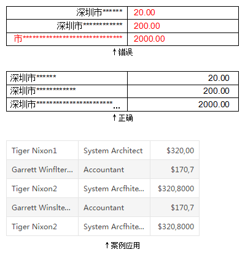
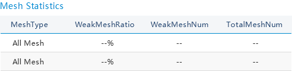
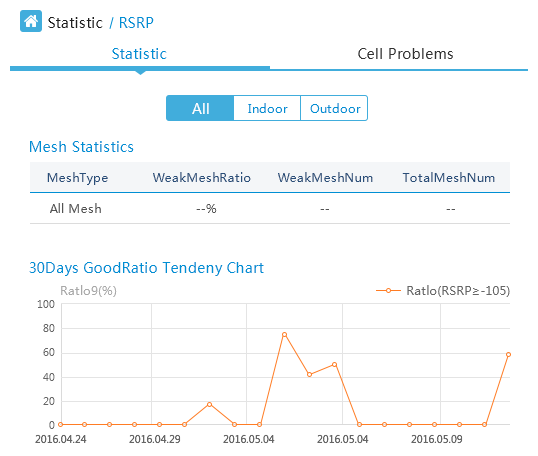

##  表格 Table

表格作为大数据可视化的关键组件，它能够直观，清晰，准确的展示已知多数据的关联属性。为数据提供呈现支持,以实现对数据的可视化分析。

!!! wrap

::: left

### 设计方法：

#### 文字类左对齐，数据类右对齐。

基于特定维度进行对比，便于观察者更快速的了解数据。文字阅读顺序是从左至右，中文文字书写习惯是大级前缀在前，小级在后，如果文字右对齐的话，可能隐藏开头的文字。数字右对齐便于对比数字分位，更直观。当内文字符长度超出单元格宽度时，以“…”显示。

#### 设计表单样式需要考虑遵守“三色原则”：首行、首列最深，间行间列留白。

表格设计的过程可分为数据处理层面和视觉展示层面。设计原则是让用户在界面中顺畅的找到关键数据，轻松的浏览信息。用于显示数字和其他指标项以便快速引用和分析。表格呈现要能够更好地帮助用户理解内容并与之互动，风格样式上却不会分散用户对表格数据本身的注意力。

:::

::: right

:::

!!!

!!! wrap

::: left

### 固定列表格：

注重表格和周边文本元素的布局关系，布局作为一种沟通语言，它不仅仅局限在元素摆放上，提升重要内容或操作视线引导，确保表格组件在布局中有良好的易读性，与周边元素组成有机整体，具体实践方法例如利用视觉重量和平衡使文本归属层次和分区明显，表格框架四周边距和行高，所有字体和数据都清晰呈现，一目了然。注重边距行高的艺术价值，使得界面看起来更加聚焦和高效。

:::

::: right

:::

!!!

!!! wrap

::: left

###  表格视觉流：

布局设计关系到界面视觉流，避免操作在使用起来很隐晦。表格呈现时，确保在短时间内，传达给用户重要信息，层级归属，操作流程等。无论暗色或浅色模式上看起来都干净，纯粹。表格界面层次足够清晰，以便于用户快速发现自己想要的信息；同时，还要保证浏览过程中的易读性，如文字大小，文字和背景的对比度设计。如果关键操作按钮的不合理摆放位置，导致用户不能快速识别出来，就是视觉流的问题。所以，同时需要考虑用户使用产品的视觉轨迹，避免排版混乱。

:::

::: right

:::

!!!