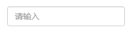
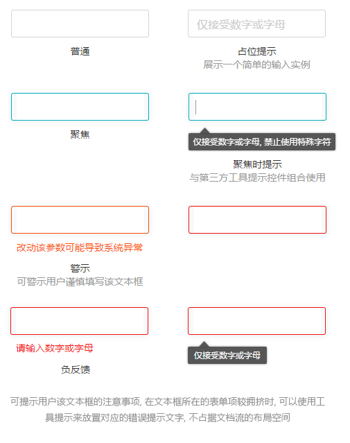
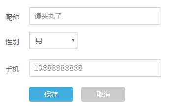
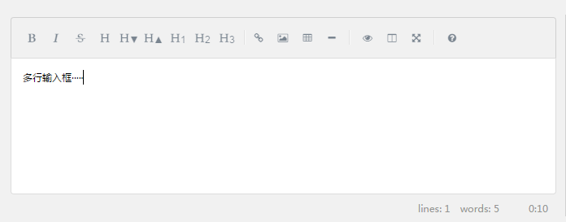
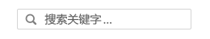
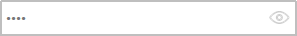

##  输入框 Input ##

!!! wrap

::: left

存放输入内容的容器，作为获取用户输入数据的一种方式。用户在输入框中可以输入或编辑一行或多行文本，可以包含纯文本或样式文本。   
:::

::: right

:::

!!!

!!! wrap

::: left

### 设计方法 ###

- 使用清晰的介绍性标签或占位符文本来帮助用户使用。标签可帮助用户了解他们应该输入的信息类型。当字段中没有其他文本时，文本字段也可以包含占位符文本。当占位符文本存在时，标签通常是不必要的。

- 最大限度地，将文本字段的大小与预期文本的数量进行匹配。如果输入框尺寸是按照输入内容的长短、尺寸来设计的话，会更加适宜用户阅读和输入。

- 用户在使用时，在输入框中获得焦点事件，同时光标停到文本框，可以直接在输入框中输入文字或文本信息。当用户选中准备输入的时候，应当提供清晰的视觉提示，比如外发光的输入框，或者闪动的光标。

- 应适当地执行字段验证，让用户知道他们是否输入了无效值。如果某个字段的唯一合法值是数字字符串（如果用户输入的数字不是数字），则应用程序应该提醒用户。在大多数情况下，检查数据的触发操作是用户在场外点击Return，Enter或Tab键。

- 帮助信息（或相关文字）应当出现在需要的地方，比如表单中用文字说明为何需要填写邮箱，以及填写后会带来的福利。它们适时地出现，帮助用户解释了一些令人困惑的问题。一般说来，这类帮助信息最好不要超过100字。

:::

::: right

:::

!!!

!!! wrap

::: left

### 单行输入框 ###

1.使用多个单行文本框组合来捕获文本信息时，如果文本框在本质上相关联，请将它们分在一组。 
2.使单行文本框的大小比最长的预期输入稍微宽一些。 如果执行此操作后导致该控件变得过宽，请将其分成两个控件。（如可以将一个地址输入拆分为“地址行 1”和“地址行 2”。） 
3.设置可输入字符的最大长度。 如果备份数据源不允许输入长字符串，请限制输入并使用验证弹出窗口来让用户知道何时达到限制。

:::

::: right

:::

!!!

!!! wrap

::: left

### 多行输入框 ###

1.创建文本框时，使用与应用样式一致的字体。或提供样式按钮并实现它们的操作。 
2.使文本控件的高度足够大，以便容纳典型输入。 
3.默认情况下，任何文本超出文本域的边界时，应相应调整换行。 
4.如果要捕获具有最大字符或字词计数的长文本，请提供实时运行计数器，以便向用户显示他们在达到上限前还能输入多少字符或字词。实时运行计数器可以放在文本框下面，并在用户输入每个字符或字词时动态更新它。 
5.当用户仅需要一行时，不要使用多行文本框。

:::

::: right

:::

!!!

!!! wrap

::: left

### 搜索输入框 ###

1.一般包含“搜索”按钮以及“清除所有”按钮（“X”），能够实现搜索的功能。 
2.一般为单行的输入框，且对搜索框输入长度有限制。单行输入有利于用户精确提取关键字，符合用户查找信息的习惯，且避免了换行“Enter键”与执行搜索的“Enter键”产生的操作冲突，也不会降低搜索速度。

:::

::: right

:::

!!!

!!! wrap

::: left

### 网址输入框 ###

1.网址输入框一般存在于浏览器中，由网页信息图标以及收藏网址按钮组成。 
2.单击网址，进行全选操作。单击后在输入框内的空白处点击，光标变为输入符号“I”。

:::

::: right

:::

!!!

!!! wrap

::: left

### 密码输入框 ###

1.应使用星号或圆点等匿名符号替换输入文本。一般指定用户可输入的最大字符数，不存在指定最小长度的属性。 
2.一般都会禁止把密码从剪贴板拷贝出去，杜绝把密码放进剪贴板的可能，降低用户密码泄露的几率。 
3.一些密码输入框具有内置的按钮，可以进行明文输入或加密输入的切换。默认状态下是加密输入。

:::

::: right

:::

!!!

