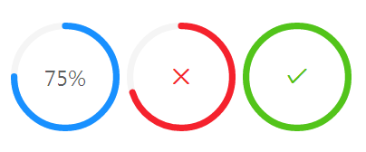

## 进度条 Progressbar ##

!!! wrap

::: left

一种表示单个任务处理进度的控件，控件会根据操作状态发生实时变化。

:::

::: right

:::

!!!

!!! wrap

::: left

### 设计方法 ###

在操作需要较长时间才能完成时，为用户显示该操作的当前进度和状态。

• 当一个操作会打断当前界面，或者需要在后台运行，且耗时可能超过2秒时； 
• 当需要显示一个操作完成的百分比时。

:::

::: right

:::

!!!

!!! wrap

::: left

### 基础用法 ###

标准的进度条
 
1、在处理任务时，实时以图片形式显示处理任务的速度，完成度，剩余未完成任务量，和可能需要处理部分的占比，一般以长方形条状显示。 
2、有不同的状态表示，如：运行正常、运行失败、运行完成。 
3、进度条后面可以有表示具体完成度的百分比数值。 

:::

::: right

:::

!!!
 
!!! wrap

::: left

### 圆形的进度条 ###

1、以圆环状表示，灰色背景，当颜色填满整个环时，表示任务完成度为100%。 
3、通常有表示具体完成度的百分比数值。

:::

::: right

:::

!!! 

!!! wrap

::: left

### 渐变色进度条 ###

进度条可以是单一颜色的，也可以填充渐变的色值。

:::

::: right

:::

!!!

