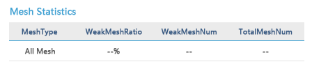

## 选项卡 Tab ##

!!! wrap

::: left

选项卡又称为页签，是切换组件。提供平级的区域将大块内容进行收纳和展现，保持界面整洁。tab页签将相关信息按标签页进行分类展示，例如在地图上，支持切换显示不同的维度，如室内外区分等。

:::

!!!

!!! wrap

::: left

### 设计方法 ###

- 包含两个或两个以上的部分，每部分作为一个互斥的按钮。

- 在布局分布上，所有的段宽度相等。可以包含文本或图标。

- 限制Tab的数量，从而提高可用性。建议保持选项数量在5个以下，超过建议改用其他控件。

- 保证在同一区域内的Tab页签的内容大小一致。

- 避免文本和图像在同一页面内混用，展现方式应保持一致。

- Tab的文本不得超过3个词组（不含连词），文本显示不全时，则以“...”结尾，同时给出tips提示帮助用户阅读。

:::

::: right

:::

!!!

!!! wrap

::: left

### 线条式一级页签 ###

一般用于将容器内部的相关信息进行分类展示，从属于页面信息的第一层级，是比较常用的Tab。

1.当需要将相关的大量信息集合进行分类（信息集合分类≥2）展示时，建议使用一级线条式页签。 
2.当展示时，焦点默认状态默认选择第一个页签，附加色彩叠加效果和强调效果。 
3.页签本身作为容器集合大量信息，因此不建议页签内部重叠嵌套页签。 

:::

::: right

:::

!!!

!!! wrap

::: left

### 线条式二级页签 ###

一般多用于一级页签的分类信息之中，对单个模块内部某一区域的信息进行集合分类。

1.该类页签常用于表格中。 
2.此类页签分类较多，通常只由文本构成，不建议使用或增加图标。 
3.使用简明的选项卡标签，使用的词能清晰描述页面的内容。 

:::

::: right

:::

!!!

!!! wrap

::: left

### 按钮页签 ###

常用于一级菜单内元素信息或者小模块之间的多维度切换查看，也称为“切换按钮”。在特定区域内由2~3个不同的模块构成，不同模块的内容可以进行快速切换的操作，提高查看效率。

1.当在有限的页面需要查看多个相关模块的信息内容，且模块的信息层级相等时，可以考虑使用切换按钮将模块信息聚合在一个页面里（模块层级低于导航或第一层级）。 
2.当1＜模块内容≤3时，方可使用切换按钮；超过3个时，建议更换成Tab页签。 
3.切换按钮通常只存在默认状态和悬浮状态。 
4.应用在PC界面上的切换按钮都需要结合文本一起使用；由于空间限制，不建议在按钮上增加图标。

:::

::: right

:::

!!!

