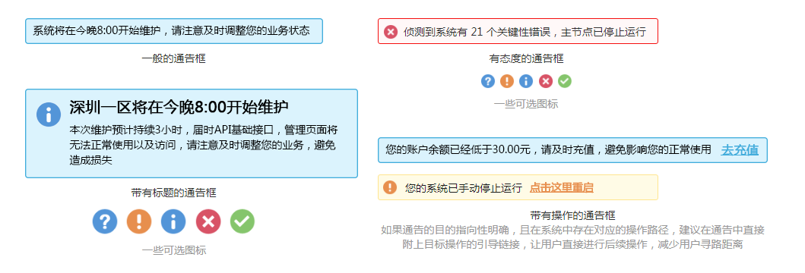

## 通告 Notice ##

!!! wrap

::: left

通告提示是提示框的其中一种用于警示的场景，用于展现用户在进入页面时需要关心的关键性信息，对用户起到警示作用。

:::

!!!

!!! wrap

::: left

### 设计方法 ###

- 通告提示并没有固定尺寸的限制，通常根据展示文本的长宽进行尺寸设定。

- 通告提示都是在情况特殊紧急、有重要信息需要告知用户的时候出现，所以文本都是围绕警告、提醒、高度注意这些方面的内容进行撰写。

- 在情况紧急并可以让用户自行解决问题的情况下，通告提示会出现浮动的操作按钮链接；用户通过点击链接按钮可跳转到解决问题的页面完成剩下的操作。

- 在情况紧急特殊并且用户无法自行解决问题的情况下，可以再通告提示中详细描述该问题发生的原因或者在此期间给予用建议。

:::

::: right

!!!

!!! wrap

::: left

### 通告提示 ###

通告提示用于警示告知用户某些重要、紧急的信息，提醒用户重视已发生的问题，防止用户在使用的过程中遇到可以避免的错误。某些时候告知用户问题时还会提供用户解决问题的按钮链接。

1.通告提示承载的内容较为复杂，且多于消息框和提示框。 
2.在可以解决用户问题的情况下，系统会在页面上显示带有交互性的通知，用户通过点击链接按钮进行下一步的操作。 
3.考虑到通告提示的应用场景和重要性，建议让通告提示的辨识度尽可能高，或者根据通知的紧急程度进行相应的背景或边框的用色（例如，红色代表非常紧急的情况；橙色代表次紧急的情况）。 
4.通告提示的样式分为:文本、文本与图标结合、带有标题的、带有按钮链接的通告提示着四类。基本情况下的通告建议使用文本的通告；当事件异常紧急时，建议使用带有与内容相符的图文结合的通告；当通告内容较多时，建议使用带有标题的通告（标题精炼概括）；给用户提供解决方案时建议使用带有按钮链接的通告提示（用文本按钮，不建议使用图形按钮）。 
5.考虑到通告提示的显示的必要性，用户不与之交互或关闭则长久停留在页面（不影响用户操作），建议给通告提示增加关闭的按钮。

:::

::: right

:::

!!!

