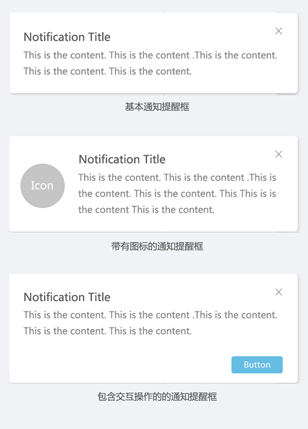

## 通知提醒框 Notification ##

!!! wrap

::: left

通知提醒框是系统让用户及时了解到具体发生的事件，通过全局展示来通知提醒信息。

:::

::: right

:::

!!!

!!! wrap

::: left

### 设计方法 ###

- 通知提醒框的布局在基础上应包含通知标题和消息。即时性消息应适当添加时间戳。

- 通知提示框为非模态框，应用户即使不回应也可以进行其他操作

- 仔细考虑需要放置在通知提示框中的操作数量，放置越多的操作认知越复杂，请选择真正重要和有意义的一两个操作。

- 可放置在通知提示框中的操作应具有以下特性：对于该通知重要、常用和典型的操作，时间紧迫的，不会与相邻操作重复的。

- 一个页面有默认最多承载通知提醒框的条数，当显示的通知超过该页面承载条数时，则从最早显示的信息或优先级最低的信息开始逐条消失。

:::

::: right

:::

!!!
 

 

!!! wrap

::: left

### 后台消息提醒 ###

由于应用在后台运行，所以它意图要做什么我们无法看到，此时可以通过Notification来显示提醒，例如接收到后台音乐播放软件的消息。 

1.把应用作为次要图标放在通知提醒框内，让用户知道是哪个应用发出的通知。 
2.用户点开通知提醒框后，打开应用并且将用户带到可以直接操作该通知内容的界面上。 
3.如果进入的不是应用的顶级屏幕，那么在后退历史中增加导航路径，使用户可以通过“返回”键回到应用的顶级屏幕。 
4.自定义通知提醒框应设置固定的背景，比如黑色，那么内容自然就是白色或近似白色。或者是通过读取系统的通知提醒框样式文件，获取到title和content的颜色，进而将这个颜色设置到自定义通知提醒框上。这样，在所有样式界面上都能正常显示，做到良好适配。

 

:::

::: right

:::

!!!

!!! wrap

::: left

### 后台任务反馈 ###

正在进行的通知可以显示用户对较长任务的反馈，如下载文件或编码视频，或者显示音乐播放软件正在播放的曲目。 
1.由于是进行中任务的反馈，所以应具备对任务进行暂停，取消或重启的功能。 
2.任务进行应有进度的提示。

:::

::: right

:::

!!!

 
 
 
 
 

