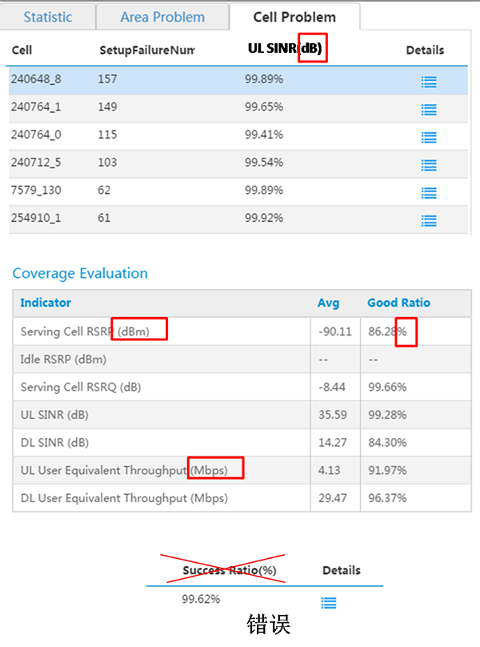

##  单位格式[Unit format]

!!! wrap

::: left

### 适用范围 ###

横向表头、竖向表头、网格内

单位通常跟在标题后面，如UL SINR(dB)、DL User Equivalent Throughput(Mbps)

### 特殊情况 ###

“%”呈现时均为“数字+%”，如：45%；

若是无值时为“--”；

若是趋势图中，百分比作为单位在纵轴标题统一标注，纵轴杆上为“数字”，浮窗中呈现指标值为“数字+%”。

:::

::: right

:::

!!!