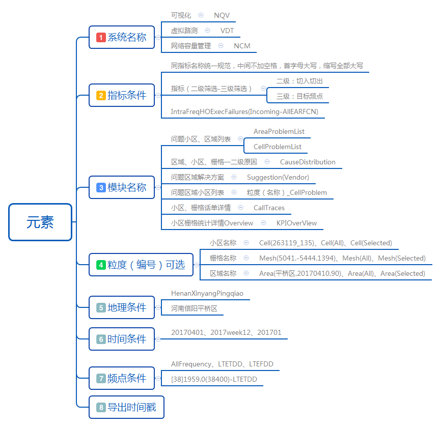

##  命名规则[Naming Rule]

不统一的书写和命名方式，对于维护及理解造成很大障碍。命名规则可确保应用系统命名的一致性和可追踪性。一个良好的页面命名, 帮助用户快速认识系统功能。 

!!! wrap

::: left

### 侧边面板命名规则

#### 侧边面板的名称组合分为三部分: 页面图标、页面名称、页面详细。

#### 1.页面图标

根据对比功能的呈现页面， 有不同的对比图标来表示当前页面的类型，分为：基准窗口、差值窗口、对比窗口 当页面下钻到二级或更深层级时， 图标变为箭头返回按钮 

#### 2.页面名称

页面名称用于表示当前页面的功能以及特性，并始终于面包屑的最后一位保持同步。

#### 3.页面详细
 
除页面名称外，页面详细用于进一步阐述当前页面的作用以及相应的内容呈现 如：点击某频点后下钻到二级页面，则页面名称展示当前界面的作用，详细说明显示该页面呈现的对应频点。

:::

::: right

:::

!!!

!!! wrap

::: left

### 导出文件命名规则

导出文件的默认名称统一，包含基本的元素以及相应的书写规则，方便接收方从命名文件就能够明白文件的主题，方便整理规划，快速检索到所需要的文件。

:::

::: right

:::

!!!
    
!!! wrap

::: left

### 元素种类及书写规范

- 导出文件名的元素组成，图示为最全情况，根据具体功能选择显示相应的元素模块 

- 元素与元素间使用“_”链接 

- 所有英文字母的首字母大写，缩写全部大写 

- 时间与查询条件规范保持一致，采用“20170723”、“2017week16”、“201701” 

- 地区使用标准地区名称，不建议使用地区编码 

- 指标名称与指标查询条件保持一致，不添加空格

- 元素内多余的变量使用“()”括起来，并使用“-”分隔，例如“IntraFreqHOExecFailures(Incoming-AllEARFCN)”

### 小区栅格区域命名规则

显示查询和分析当前位置的信息状态，提供信息支持与服务。 GIS内存在三个基本可互动元素：栅格 / Mesh， 小区 / Cell，区域 / Area。

#### 1.栅格 / Mesh

地图拆解的最小单元，一个栅格通常代表一片地理位置，通常表示问题发生的对应点，也是问题的起点之一。 

##### 栅格命名规则：

- 实际示例：5041_-5489_1510 

- 字段显示：国际-MeshID / 国内-栅格编号 

- 命名规则：[RegionID]_[XOffset]_[YOffSet]

#### 2.小区 / Cell

指基站使用不同的电磁波覆盖不同的区域，由此分为不同的小区。通常情况下，一个基站分为三个小区。
 
##### 小区命名规则：

- 实际示例：64651_0 

- 字段显示：国际-CellKey / 国内-小区编号

- 命名规则：国际-[CellName] / 国内-[EnodeB ID]_[CellID]

#### 3.区域 / Area

栅格的集合，通常我们会针对一定范围内的低质量栅格进行统计，再将其划分为特定区域，便于从区域中快速定位问题。

##### 区域命名规则：

- 实际示例：信阳市区_20170420_250 

- 字段显示：国际-AreaName / 国内-区域编号

- 命名规则：[行政区/县（系统部署区域的最小行政区划单位)]_[YYYYMMDD]_[ID]

- zz 为当前的周数，需要两位 01，02，..，52
    
- qq 为当前的月数，需要两位 01，02，..，12
    
- W/M 当为周粒度使用W，月粒度使用M
    
- id 为当前区域，当前日期，当前功能按排序规则排列出来的序号，序号从1开始顺序累加，目前建议最长不超过3位。

:::

::: right

:::

!!!