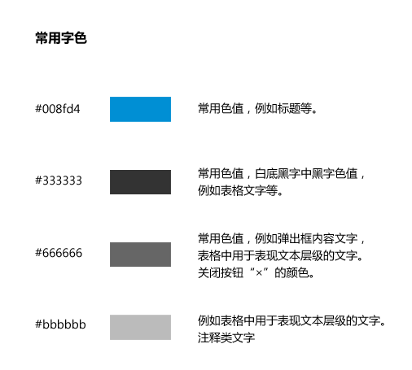
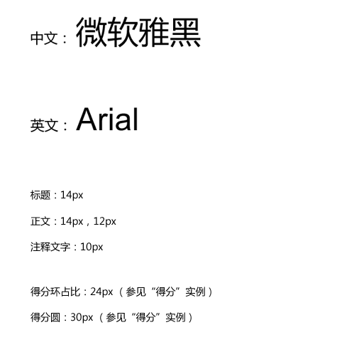
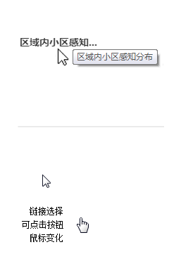

## 文字[Font] ##

从界面中文字的使用规则到字体颜色的选择，都有具体细致的说明。

文字看似简单直接的界面元素，却在界面应用中字号，字体颜色，间距经常影响着界面质感和气氛。

!!! wrap

::: left

### 设计方法

根据文字的显示场景和文字层级，来配置参数，但要首先保证文字的识别性和易读性。

与图形一样，文字同样需要设计，细节决定品质，文字设计一样需要考虑：平衡、风格、层级和留白。

网页上的文字不仅仅作为内容而存在，它还是用来交互的界面。  ——  OliverReichenstein

:::

::: right

:::

!!!

!!! wrap

::: left

### 字体样式

中文： 微软雅黑，冬青黑体，苹方字体

英文、数字： Arial，Helvetica

字号： 按文字层级来配置字号，如一级标题，二级标题，一级正文，二级正文，注释。

:::

::: right

:::

!!!

!!! wrap

::: left

### 字符溢出

当前长字段超过其指定宽度时,字符溢出Overflow的写法。 overflow 属性规定当内容溢出元素框时发生的呈现方式。

#### 1）确保关键数据没有被截断，除非数据特别长。

当长数据或字符内容溢出单元格或限定区域时用“…”显示，鼠标指向时，弹出气泡框并且有被省略的全部字段显示。 

#### 2）状态可见。

被省略的字段同时作为“可点击对象”，鼠标指向该字段时，指针变化，变成意为链接选择的"小手"。

:::

::: right

:::

!!!
