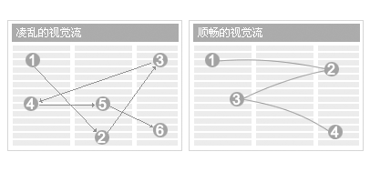

## 布局[Layout] ##

布局是关系到整体全局层面的设计，布局设计是指各组件间的空间关系，尺寸，间距等。

布局结构是整体形象的关键点，整体布局会影响到组件元素的位置，次序，逻辑关系，操作顺序，组织化程度。

!!! wrap

::: left

### 常用布局

自适应布局可以考虑等分或占比设置，使得组件的尺寸和定位在布局中有适应标准。同事可用margin的统一设置来控制组件的距离。

:::

::: right

:::

!!!

!!! wrap

::: left

### 设计方法

界面布局设计主要是对构思，组织，页面整体安排的规划性设计。有效的布局设计应具有以下特点：

#### 1.明确的焦点，清晰的视觉流：

焦点： 注意力的集中点。通过颜色，形状，大小等形式突出界面中重要的信息，同时也要避免次要信息喧宾夺主。

视觉流： 用户浏览信息时的眼动轨迹。可以基于人眼运动规律，人眼偏好等分析，结合任务逻辑来设计恰当的视觉流。视觉流引导用户操作，视觉流的理念是清晰、合理、顺畅、自然。通过布局设计对信息进行有效组织、提炼、展示，布局可以引导用户操作。不顺畅的布局会对用户阅读带来干扰，降低任务的完成效率。同时是区分界面重要信息和次要信息的切入点。

#### 2.用视觉平衡审视整体页面：

布局： 适时引入流式布局或自适应布局，避免界面膨胀拥挤或界面空间的浪费。

留白： 利用留白提升页面视觉效果，有意识的设置行距，间距，边距，使其舒适均衡。

#### 3.简约富有张力的布局：

不用布局本身作为突出的UI元素，减少内容和展现上的嵌套层级。

#### 4.运用Ui网格布局：

Ui网格让设计更规整统一，让设计师和开发人员用更科学规律的方法去布局页面。

#### 5.设置页面定宽：

自适应可以根据分辨率情况，浏览器的展示环境来自动调整页面宽度。在文本展示时，可从可读性上考虑一行内文本字符的显示，一行不宜显示过长文本，过长的文本很难让用户聚焦到文本的起点和终点。页面过窄会使自适应布局变形和内容错乱，所以，设定页面宽度是必要的。除了卡片式流动式布局设计带来的感官体验。

定宽参考： 选用定宽界面布局时，可选用960px的页面宽度。基于计算机主流分辨率应用、人机工程学中对水平视角和聚焦范围的研究，推荐把定宽设置为960px，去除左右各4px的边距，中间的可视宽度为952px。

:::

::: right

:::

!!!